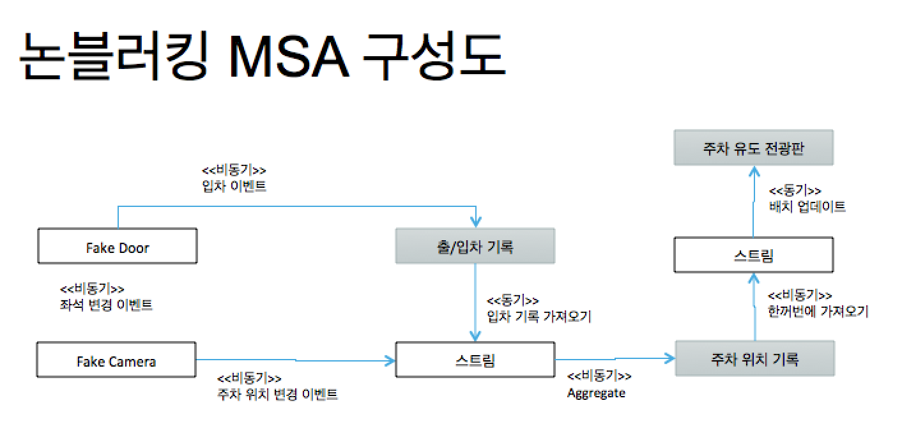

# cloud-stream-reative-kafka-webflux-demo

# 참조문서

[SPRING BOOT2로 REACTIVE WEBFLUX API 만들기 1](https://inyl.github.io/programming/2018/03/10/springboot2_api.html)

[스프링부트2 eureka - web flux](https://piotrminkowski.wordpress.com/2018/05/04/reactive-microservices-with-spring-webflux-and-spring-cloud/)

[Functional program](https://dzone.com/articles/functional-programming-java-8)

[함수형 프로그래밍](https://medium.com/@goinhacker/java-8%EA%B3%BC-%ED%95%A8%EC%88%98%ED%98%95-%ED%94%84%EB%A1%9C%EA%B7%B8%EB%9E%98%EB%B0%8D-154e6d8830f1)

[스프링 인티얼라이저](https://start.spring.io/)

[Jpa async call - webflux](https://dzone.com/articles/spring-5-webflux-and-jdbc-to-block-or-not-to-block)

[Java stream api](https://wraithkim.wordpress.com/2017/04/13/java-8-%EC%8A%A4%ED%8A%B8%EB%A6%BC-%ED%8A%9C%ED%86%A0%EB%A6%AC%EC%96%BC/)

[reactive-streams 표준 스펙](http://eyeahs.github.io/blog/2017/01/24/a-journey-into-reactive-streams/)

[Flux,Mono example](https://www.infoq.com/articles/reactor-by-example)

[How to take control over the execution of Mono and Flux](https://medium.com/@cheron.antoine/reactor-java-4-how-to-take-control-over-the-execution-of-mono-and-flux-ead31dc066)

[Mono and Flux method tutorial (async calls and combine)](https://projectreactor.io/docs/core/release/reference/#mono)

[Java8 map and flatmop](https://qkrrudtjr954.github.io/java/2017/10/15/difference-between-map-and-flatMap.html)

[Ways to combine Publishers](http://javasampleapproach.com/reactive-programming/reactor/reactor-how-to-combine-flux-mono-reactive-programming)

[ppt 작성 참조](http://wiki.sys4u.co.kr/pages/viewpage.action?pageId=7766994)

[cloud stream kafka](https://dzone.com/articles/spring-cloud-stream-with-kafka)
